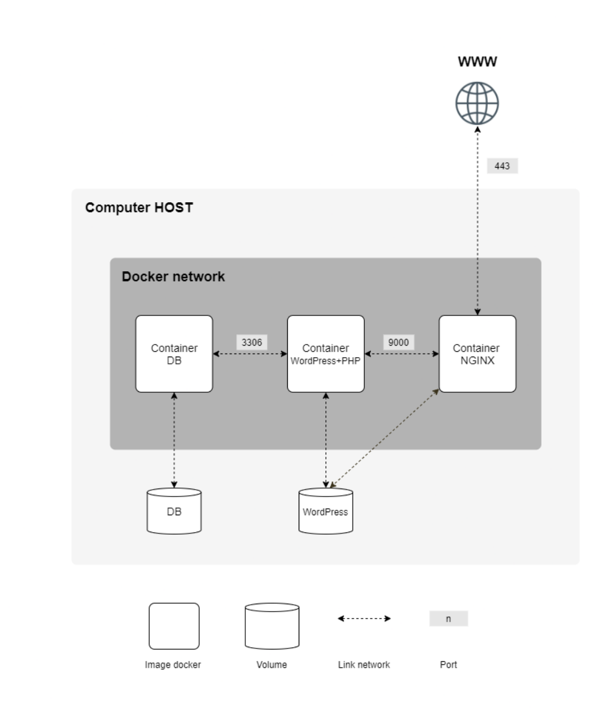

# Inception
This project is an exploration of Docker, a powerful tool for virtualizing applications through containers. The project involves setting up a small infrastructure composed of different services, each running in its own Docker container. This README outlines how to configure and run the project.

# Project Setup

## Requirements
A Virtual Machine for running the Docker containers.
Docker and Docker-compose installed on the VM.

## Services Overview
- ***NGINX Container***: Acts as the sole entry point for the infrastructure, accessible via port 443 with TLSv1.2 or TLSv1.3 protocol.
- ***WordPress Container***: Runs WordPress with php-fpm, without NGINX.
- ***MariaDB Container***: Manages the database for WordPress, runs independently.
- ***Volumes***: Two Docker volumes are used, one for the WordPress database and another for WordPress website files.
- ***Docker Network***: A dedicated network for container communication.

```
  $ git clone https://github.com/clemedon/inception
  $ cd inception
  $ make
  $ firefox inception.fr
```




